<div align="center">

<picture>
  <source media="(prefers-color-scheme: dark)" srcset="docs/banner-dark.svg">
  <source media="(prefers-color-scheme: light)" srcset="docs/banner-light.svg">
  
</picture>

[](https://github.com/maximilianfeix/spillage/actions/workflows/tests.yml)
[](https://github.com/maximilianfeix/spillage/releases/latest)
[](pyproject.toml)
[](pyproject.toml)
[](#faq)
[](LICENSE)

<a href="#install"></a>
<a href="#scrub"></a>
<a href="#guard"></a>
<a href="#what-it-finds"></a>

[Website](https://maximilianfeix.github.io/spillage/) · [Install](#install) · [Where it looks](#where-it-looks) · [What it finds](#what-it-finds) · [Scrub](#scrub) · [Guard](#guard) · [Repos & CI](#repo) · [How it works](#how-it-works) · [FAQ](#faq)

</div>

---

Your coding agent writes down everything. Every `.env` it read, every key you pasted "just to test this one call", every `printenv` it ran to debug something. Claude Code, Codex, Gemini CLI, Cline and the rest keep those conversations on your disk as plain JSON, and every one of those keys was also sent to the model provider when it happened.

**spillage** finds them. It reads the logs of thirteen coding agents, tells you which keys leaked, *how* they got there (you pasted it, a tool printed it, the model repeated it) and links you to the page where you rotate each one. Then it scrubs them from disk and installs hooks so the next one gets blocked before it's sent.

<div align="center">

</div>

- **Zero dependencies, zero network.** Standard library only. Nothing leaves your machine, ever. Secrets are only ever shown masked.
- **Knows the formats.** Tells a pasted prompt from tool output from a model answer, per agent. Finds keys inside JSON-escaped text, like a private key a tool printed with `\n` in it.
- **Few false alarms.** GitHub tokens are checked against their built-in CRC32, JWTs have to decode, Discord tokens have to hold a real user id, placeholders like `sk-...your-key-here` are skipped.
- **Fast.** Rules run over the raw files with literal-prefix regexes on all cores. About 240 MB of real agent history in under 4 seconds on a laptop.
- **Fixes it, too.** `scrub` redacts in place without breaking the JSON your agent reads back for `--resume`. `guard` blocks the next leak in Claude Code, Codex and Gemini CLI.

<details>
<summary><b>Table of contents</b></summary>

- [Install](#install)
- [Where it looks](#where-it-looks)
- [What it finds](#what-it-finds)
- [Commands](#commands) · [Reports](#reports)
- [Scrub](#scrub)
- [Guard](#guard) · [Watch](#watch)
- [Committed transcripts](#repo): GitHub Action, pre-commit
- [How it works](#how-it-works)
- [From Python](#from-python)
- [FAQ](#faq)
- [Roadmap](#roadmap) · [Contributing](#contributing)

</details>

<a id="install"></a>

## Install

```bash
brew install maximilianfeix/tap/spillage
spillage
```

Or with [pipx](https://pipx.pypa.io/):

```bash
pipx install git+https://github.com/maximilianfeix/spillage
```

Or run it once without installing anything, with [uv](https://docs.astral.sh/uv/):

```bash
uvx --from git+https://github.com/maximilianfeix/spillage spillage
```

Python 3.9 or newer, on macOS, Linux and Windows. No dependencies to audit, which seems fair for a tool you point at your secrets.

<a id="where-it-looks"></a>

## Where it looks

| Agent | What gets read |
| --- | --- |
| **Claude Code** | `~/.claude/projects/**/*.jsonl` (sessions), `history.jsonl`, `file-history/` (backups of files it edited), `paste-cache/`, `shell-snapshots/`, `todos/`. Honors `CLAUDE_CONFIG_DIR` |
| **Codex CLI** | `~/.codex/sessions/`, `archived_sessions/`, `history.jsonl`, `log/`. Honors `CODEX_HOME` |
| **Gemini CLI** | `~/.gemini/tmp/*/chats/`, `logs.json`, checkpoints |
| **OpenCode** | `~/.local/share/opencode/storage/` |
| **Cline, Roo Code, Kilo Code** | task histories in the extension storage of VS Code, Cursor, Windsurf, VSCodium and Kiro |
| **Continue** | `~/.continue/sessions/` |
| **Cursor** | chats in `state.vscdb` (SQLite), global and per workspace. Only chat rows are read, never Cursor's own login |
| **Qwen Code** | `~/.qwen/tmp/*/chats/`, logs and checkpoints |
| **Goose** | `~/.local/share/goose/sessions/sessions.db` (SQLite) and older `~/.config/goose/sessions/*.jsonl` |
| **Crush** | `.crush/crush.db` (SQLite) in each project it knows about |
| **Aider** | `.aider.chat.history.md` and `.aider.input.history` in your projects |
| **SpecStory** | `.specstory/history/*.md` in your projects |
| **GitHub Copilot CLI** | `~/.copilot/session-state/`, `history-session-state/` |
| | Aider and SpecStory write into the project folder, so spillage checks the current folder plus every folder your Claude Code and Codex sessions ran in |
| **anything else** | `spillage --path <file or folder>`, any mix of JSONL, JSON and text |

`spillage agents` shows what it found on your machine:

```
  ● claude    Claude Code          441 files, 216.4 MB
    ~/.claude
  ● codex     Codex CLI            4 files, 55.0 MB
    ~/.codex
  ○ gemini    Gemini CLI           not found
    ~/.gemini
```

<a id="what-it-finds"></a>

## What it finds

56 rules. Each one knows the key's exact shape and where to revoke it.

| | |
| --- | --- |
| **AI providers** | Anthropic (API, admin, and Claude Code OAuth tokens from `claude setup-token`), OpenAI (user, project, service account, admin), OpenRouter, Google AI / Gemini, Hugging Face, Groq, xAI, Perplexity, Replicate |
| **AI app stack** | Supabase secret keys, LangSmith, Pinecone, Tavily, Firecrawl, Resend, PostHog, Vercel Blob. Most of these aren't in gitleaks' default rules |
| **Code and packages** | GitHub (classic, OAuth, app, refresh, fine-grained; checksum-verified), GitLab, npm, PyPI |
| **Cloud and infra** | AWS access key id and secret key, Google OAuth client secrets and refresh tokens, DigitalOcean, Databricks, Doppler, HashiCorp Vault, 1Password service accounts, PlanetScale |
| **Payments and SaaS** | Stripe (live is critical, test is low), Slack tokens and webhooks, Discord bot tokens and webhooks, Telegram bots, SendGrid, Brevo, Twilio, Shopify, Linear, Notion, Sentry, Grafana, Postman, Atlassian, Figma |
| **Everything else** | private keys (RSA, EC, OpenSSH, PGP, …), database URLs with a password in them, JWTs (Supabase `anon` keys count as low), and `API_KEY=…` / `"client_secret": "…"` / `Bearer …` with a high-entropy value |

**Plus your own secrets.** Patterns can't recognise a random database password or an Azure key. So spillage also reads the `.env` files in your projects (the current folder and every folder your agent sessions ran in), takes the values of anything named like a key, token, secret or password, and looks for those exact strings in the logs. They show up as *Value of POSTGRES_PASSWORD from ~/code/shop/.env*, never with the value itself. `--no-env` turns that off; the `.env` files are only read, never changed.

`spillage rules` lists them with their ids. Leave some out with `--skip-rules jwt,generic-secret`.

<a id="commands"></a>

## Commands

```
spillage                          scan every agent it knows (same as `spillage scan`)
spillage scan --since 7d          only logs written in the last week (also 12h, 2w, 2026-09-01)
spillage scan --agent claude      only some agents, comma separated
spillage scan --min-severity high skip the low and medium stuff
spillage scan -v                  every place a secret was seen, not just the first
spillage scrub                    remove what it found from the logs (asks first)
spillage guard install            agent hooks that block the next leak
spillage watch                    tell me the moment a new key lands in any agent's logs
spillage repo                     agent transcripts committed to this git repo, and secrets in them
spillage check "some text"        scan a string, or stdin: pbpaste | spillage check
spillage ignore <fingerprint>     stop reporting a secret (a test key, say)
spillage agents                   which agents were found, and where
spillage rules                    what it looks for
```

The exit code is `1` when something was found and `0` when not, so it drops into cron, a shell hook or CI as is. `--exit-zero` turns that off.

<a id="reports"></a>

### Reports

```bash
spillage scan -f html -o report.html   # a page to open in the browser
spillage scan -f json                  # for scripts: masked values, fingerprints, every location
spillage scan -f markdown              # for an issue or a PR
```

The HTML report is a single file with no CDN or web fonts, so it works offline and doesn't load anything. It shows the severity split, how the secrets got there, a timeline of when they first leaked, and every place each one was seen, with filters and search. Light and dark.

None of the formats ever contain a full secret. They show the first few characters and a fingerprint (the first 12 hex characters of the secret's SHA-256), which is also what `spillage ignore` takes.

<a id="scrub"></a>

## Scrub

```bash
spillage scrub            # shows what it will change and asks
spillage scrub --dry-run  # only shows
spillage scrub --yes --only dfd5fe8c9655,a51887eac2a0
```

Every occurrence is replaced with a marker like `[REDACTED:github-token:dfd5fe8c9655]`, so you can still see that something was there and which key it was.

It is careful with the files, because your agent reads them back when you resume a session:

- works on the raw text, so every byte it doesn't redact stays exactly as it was
- parses every changed JSON line again before writing; if a line would break, the file is left alone
- writes atomically and keeps the file mode, the modification time (so `claude --resume` still sorts right) and the line endings
- skips files written in the last minute, since that's most likely the session you're running it from

> [!IMPORTANT]
> Scrubbing cleans your disk. It does not un-send anything. Every key in these logs went to the model provider when the conversation happened, so **rotate first**, then scrub. The report links to the right page for each key.

<a id="guard"></a>

## Guard

```bash
spillage guard install    # every agent it finds; --agent claude,codex,gemini to pick
spillage guard status
spillage guard uninstall
```

Adds three hooks to **Claude Code**, **Codex CLI** and **Gemini CLI**:

| Hook | Claude Code / Codex | Gemini CLI | What it does |
| --- | --- | --- | --- |
| prompt | `UserPromptSubmit` | `BeforeAgent` | Blocks a prompt that contains a key, before it's sent. Put `spillage:allow` in the prompt if you really mean it. |
| tool | `PreToolUse` | `BeforeTool` | Blocks reading `.env` files, private keys and credential files (`.npmrc`, `.aws/credentials`, `*.pem`, …) and shell commands that would print secrets: `cat .env`, `printenv`, `gh auth token`, `security find-generic-password -w`, … The reason goes back to the model, so it asks you instead. `.env.example` and friends stay readable. |
| session end | `SessionEnd` | `SessionEnd` | Scrubs the transcript of the session that just ended. |

That last one exists because of something that came up while testing the first against the real Claude Code: **a blocked prompt still gets written into the session file.** It's never sent, but it ends up on disk as a `queue-operation` record. The session-end hook cleans that up, along with anything a tool printed that the other hook didn't catch.

The config goes where each agent expects it: `~/.claude/settings.json`, `~/.codex/hooks.json`, `~/.gemini/settings.json` (or the repo's folder with `--scope project`). Your other hooks and settings are left alone, a backup is kept the first time, and a file that isn't valid JSON is refused rather than overwritten. Each hook call takes about a tenth of a second.

> [!NOTE]
> Codex runs new hooks only after you've trusted them once: open Codex and run `/hooks`. Claude Code and Codex were tested end to end with their real CLIs; Gemini CLI follows its documented hook format.

<a id="watch"></a>

## Watch

```bash
spillage watch                  # report new secrets the moment an agent writes them
spillage watch --scrub          # and scrub the file once it's been quiet for 90 s
```

Hooks only exist for Claude Code, Codex and Gemini. `watch` covers every agent, Cursor, Cline and Aider included: it keeps an eye on all their logs, reads only what was appended since the last look, and shows a desktop notification (macOS and Linux) plus a line in the terminal as soon as a key lands:

```
  09:12:53  [HIGH]     Firecrawl API key  fc-bcc…(35 chars)  Claude Code · ~/code/shop
            a tool printed it (a file read or a command) · rotate: https://www.firecrawl.dev/app/api-keys
```

Keys that were already there when it started aren't reported again, that's what `spillage scan` is for. It polls every 2 seconds (`--interval`), which costs next to nothing and keeps spillage free of dependencies.

<a id="repo"></a>

## Committed transcripts

Some agents write their chat logs into the project, and from there they get committed. GitHub's code search finds about **16,000 SpecStory chat logs** and **5,000 Aider histories** in public repositories (September 2026). Once a key is in a pushed repo, it's not a local problem anymore.

```bash
spillage repo                 # this repository
spillage repo --strict        # also fail on transcripts without secrets in them
spillage repo --all-files     # scan every tracked file, not just transcripts
```

### GitHub Action

```yaml
# .github/workflows/spillage.yml
on: [push, pull_request]
jobs:
  spillage:
    runs-on: ubuntu-latest
    steps:
      - uses: actions/checkout@v4
      - uses: maximilianfeix/spillage@v0.5.1
        with:
          strict: true   # fail on any committed transcript
```

Each secret becomes an error annotation on the file and line, and the job summary gets a table with rotate links. Outputs: `transcripts` and `secrets` (counts).

### pre-commit

```yaml
# .pre-commit-config.yaml
repos:
  - repo: https://github.com/maximilianfeix/spillage
    rev: v0.5.1
    hooks:
      - id: spillage               # block transcripts that contain secrets
      # - id: no-agent-transcripts # or block agent transcripts altogether
```

<a id="how-it-works"></a>

## How it works

```
 agent logs ──▶ discover ──▶ raw text ──▶ 56 rules ──▶ validate ──▶ locate ──▶ dedupe ──▶ report
 (13 agents)     per agent    per file     literal-     checksums,   parse only  one finding
                                          prefix       entropy,     the JSON    per secret
                                          regexes      placeholders line with
                                          on all cores              a match
```

1. **Discover.** Each agent has a small adapter that knows where its files live and how its records say who's talking.
2. **Scan the raw text.** The rules run over each file as it is on disk, not over parsed JSON. Almost every rule starts with a literal (`ghp_`, `sk-ant-`, `AKIA`), which lets Python's regex engine jump straight to candidates instead of trying every position: 0.2 s instead of 6 s per rule on a few hundred MB. Patterns without a literal prefix (database URLs, `API_KEY=` assignments, Discord tokens) look up an anchor with `str.find` first and only run the regex there. Big scans fan out over up to 8 processes, and huge session files are cut into parts at line breaks so one 100 MB session doesn't keep a single core busy while the others wait.
3. **Validate.** GitHub tokens carry a CRC32 of themselves and have to match it. JWTs have to decode to JSON with an `alg`. Discord bot tokens have to start with a real user id. Generic secrets need a key-ish name, enough entropy, mixed character classes and no placeholder words.
4. **Locate.** Only the JSON line that holds a match gets parsed, to find out which session and project it belongs to and whether it came from a prompt, a tool result or the model. A match that only exists inside a base64 image or a thinking signature is dropped as noise.
5. **Dedupe.** One finding per distinct secret, with every place it was seen, across agents and sessions.

Sources, rules and output formats are each a small registry, so adding an agent, a key type or a format is one class or function. See [CONTRIBUTING.md](CONTRIBUTING.md).

<a id="from-python"></a>

## From Python

```python
from spillage.scanner import Scanner, scan_text
from spillage.sources import build_sources

result = Scanner().scan(build_sources(["claude", "codex"]))
for finding in result.findings:
    print(finding.severity.label, finding.rule_name, finding.masked, len(finding.locations))

scan_text("does this contain a key?")  # -> [] or a list of findings
```

<a id="faq"></a>

## FAQ

<details>
<summary><b>Does it send anything anywhere?</b></summary>
<br>

No. There is no network code in it at all: no update check, no telemetry, and it doesn't test whether keys are still valid (that would mean sending them somewhere). It reads files, and only writes when you run `scrub`, `ignore` or `guard`.

</details>

<details>
<summary><b>I deleted the key from the logs. Am I fine?</b></summary>
<br>

No. The key was sent to the model provider as part of the conversation when it happened. Rotate it. `spillage scrub` is for your disk, your backups and your Time Machine, not for undoing that.

</details>

<details>
<summary><b>Why not just run gitleaks or trufflehog on ~/.claude?</b></summary>
<br>

You can, and they're great at what they do. They're built for repositories, though: they don't know that a private key in a JSONL log is written with `\n` escapes, that a match in a base64 screenshot is noise, which session or project a line belongs to, or whether you pasted the key or a tool printed it. And they don't scrub the logs without breaking them, or hook into your agent.

</details>

<details>
<summary><b>It flagged something that isn't a secret.</b></summary>
<br>

`spillage ignore <fingerprint>` hides that one from now on (the fingerprints are in `~/.config/spillage/ignore`, one per line). If a whole rule is noisy for you, `--skip-rules`. And please [open an issue](https://github.com/maximilianfeix/spillage/issues/new?template=bug_report.yml) with the masked value and what it actually was, the rules get better from those.

</details>

<details>
<summary><b>It missed a key.</b></summary>
<br>

If it's a kind of key spillage doesn't know, [request a rule](https://github.com/maximilianfeix/spillage/issues/new?template=new_rule.yml) (describe its shape, don't paste it). If it's a format it should know, run `spillage check "…"` on a made-up key with the same shape and open a bug with that.

</details>

<details>
<summary><b>Does it work with Cursor?</b></summary>
<br>

Yes. Cursor keeps its chats in SQLite (`state.vscdb`), spillage opens those read-only and without taking a lock, so it's fine while Cursor is running. `scrub` doesn't touch that database yet; delete the chat in Cursor instead. Cline, Roo and Kilo inside Cursor are covered too.

</details>

<a id="roadmap"></a>

## Roadmap

- [ ] [CI on all three operating systems](https://github.com/maximilianfeix/spillage/issues/1)
- [x] [Cursor support](https://github.com/maximilianfeix/spillage/issues/7)
- [x] [Split huge session files across cores](https://github.com/maximilianfeix/spillage/issues/6)
- [ ] PyPI release

<a id="contributing"></a>

## Contributing

Rules and agent adapters are the most useful things to add. [CONTRIBUTING.md](CONTRIBUTING.md) has the setup and the one important rule: never commit a real secret, not even a revoked one. The tests build their fake keys at runtime.

Found a way to make spillage leak what it protects? Please report it [privately](https://github.com/maximilianfeix/spillage/security/advisories/new).

## License

MIT
