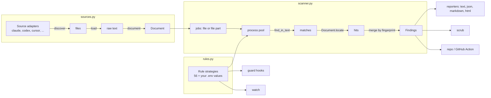

# How spillage is put together

A tour for contributors. Everything is standard-library Python, one package, no plugins to load.

## The pieces

| Module | Job | Pattern |
| --- | --- | --- |
| `rules.py` | One class per kind of match. `Rule` is a regex with a literal prefix; `AnchoredRule`, `GenericSecretRule`, `DiscordBotRule` and `KnownValueRule` override `find()` for things a single regex can't do fast. Validators (CRC32, JWT decode) and severity per match are hooks on the rule. | **Strategy**. The scanner only ever calls `rule.find(text)`. |
| `sources.py` | One adapter per agent: where its files live (`roots`, `patterns`), and how its records say who is talking (`origin`, `update_state`). `Source.load` / `document` are the shared skeleton that SQLite sources and Cursor override. | **Adapter** plus **Template Method**. New agents are a class with a `@register` decorator (**Registry**). |
| `sources.Document` | Lazy context for a match: only the JSON line (or row) with a hit gets parsed. Knows line offsets so a file can be scanned in parts. | Lazy evaluation |
| `scanner.py` | The pipeline: collect jobs, fan out over processes (big JSONL files split at line breaks), merge hits into one `Finding` per fingerprint. Progress goes out through a callback. | **Pipeline**, **Observer** for progress |
| `reporters.py`, `html.py` | Output formats, each a function registered by name. None ever gets more than the masked value. | **Registry** |
| `scrub.py` | Re-runs the rules over raw text and splices markers in; validates JSON before an atomic write. | |
| `guard.py` | Hook handlers (pure `handle(event, payload) -> (code, message)`) and per-agent config writers described by an `AgentHooks` record. | Data-driven config |
| `watch.py` | Polls logs, reads appended bytes, reuses `Document` and the rules. | |
| `repo.py` | Maps tracked files to agents and reuses the matching adapter's knowledge through a small wrapper. | **Decorator** around a `Source` |
| `repo_output.py` | Turns a repo scan into SARIF, Markdown, and GitHub annotations with a job summary. | |

## Rules of the road

- **Never let a full secret out.** `Finding.to_dict()` is the only serialisation and it has no secret field. A key can also sit in the metadata (a folder name, a session id), so `ScanResult.to_dict()` and `reporters.render()` pass everything through `hide_secrets()` on the way out. Tests check every output format against the raw values.
- **Precision over recall.** A new rule needs a positive test and at least one lookalike that must not match. Fake keys are built at runtime in `tests/fakes.py` so they never exist in the repo.
- **Literal prefix first.** Python's `re` jumps straight to a literal prefix; a leading lookbehind or character class makes it try every offset. That was the difference between 0.2 s and 6 s per rule on real logs.
- **Raw text, not parsed JSON.** Scanning the file as it is on disk is what makes both the speed and byte-exact scrubbing possible.
